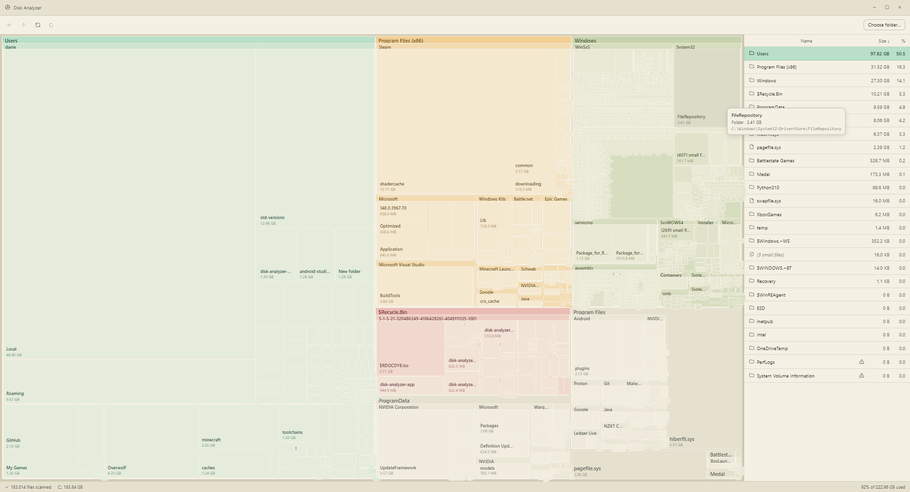

# Disk Analyzer

A Windows app that scans a folder or drive and shows you what's eating your space. You get a visual treemap on the left and a sortable file list on the right, so you can see at a glance where your storage went.

---

## Installing
Download the latest installer from the [Releases page](https://github.com/Disk-Audit/.github/releases).

---

## Using it

1. Open **Disk Analyzer** from the Start menu.
2. Click **Choose folder…**
3. Pick what you want to scan:
   - Try something small first like your **Downloads** folder to get a feel for it.
   - Or pick **`C:\`** to scan your whole drive. Expect a few minutes the first time.
4. Once the scan finishes:
   - **Hover** over rectangles in the treemap to see what each one is.
   - **Double-click** a folder in the right-hand list to drill into it.
   - Use the **breadcrumbs** at the top to jump back up a level.

### A few things you might notice while scanning

- **A ⚠ on some folders.** Windows protects certain system folders (like `System Volume Information`). The scanner skips them and keeps going. This is normal — you haven't done anything wrong.
- **"Size on disk" doesn't match Windows Explorer.** Disk Analyzer shows actual file sizes. Explorer's "Size on disk" rounds up to filesystem blocks and accounts for NTFS compression. Both numbers are correct, just measuring different things.
- **The first scan of a drive is the slow one.** Windows caches folder info after a scan, so running it again on the same folder is much quicker.

---

## Troubleshooting

**"Windows protected your PC" when running the installer.**
Click **More info**, then **Run anyway**. This is a standard SmartScreen warning for apps that aren't code-signed.

**Permission denied on system folders.**
Some folders (like parts of `C:\Windows`) require admin access. Close the app, right-click the **Disk Analyzer** shortcut, and choose **Run as administrator** to scan those.

**The app opens to a blank window.**
Close it and reopen it from the Start menu. If it keeps happening, uninstall from **Settings → Apps**, then run the installer again.

**Scan seems stuck.**
Big drives with lots of small files can take several minutes. Check the progress bar at the bottom — as long as the file count is still climbing, it's working. If nothing has moved for 30+ seconds, close the app and try a smaller folder first to confirm everything's working.

**OneDrive or `Windows.old` folders throw weird errors.**
These folders are managed by Windows in unusual ways and occasionally cause hiccups. The scan will skip them and continue.

---

## License

Released under the [PolyForm Noncommercial License 1.0.0](LICENSE). In plain English: use it, share it, modify it, build on it — just don't sell it or bundle it into something you charge for. See the `LICENSE` file for the full terms.
