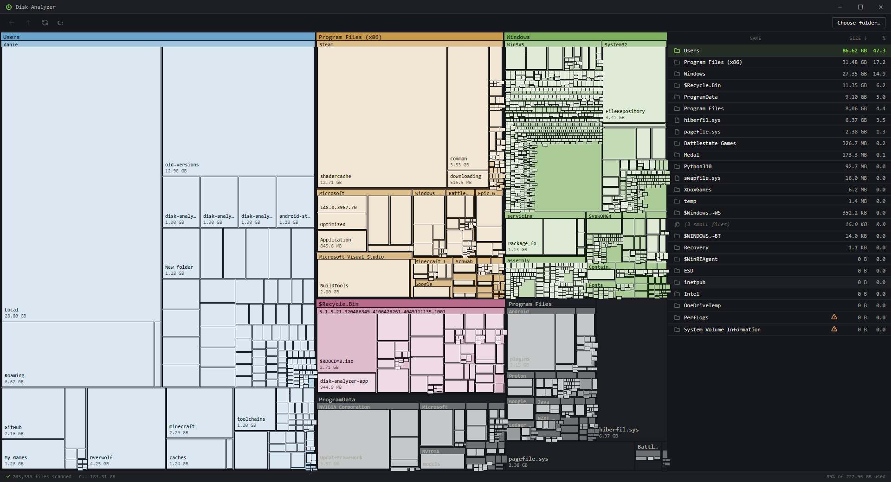

# Disk Analyzer


A cross-platform disk space analyzer (Windows + Linux). Scans a drive or folder and shows what's eating the space as a treemap, with a sortable file list alongside it.

Built with Electron + React + TypeScript for the UI, and a small Rust binary for fast scanning on Windows.

## Install

Grab the latest installer from the [Releases page](https://github.com/Disk-Audit/.github/releases). Run it, done.

Windows users get an NSIS installer (`.exe`). Linux users get an AppImage and a `.deb`.

The rest of this README is for building from source.

## What you need first

- [Node.js 18+](https://nodejs.org/)
- **Windows only:** [Rust toolchain](https://rustup.rs/) for the fast scanner (optional — the app falls back to a slower Node walker if Rust isn't installed)

On Linux the Node walker is used directly. The Rust walker is currently Windows-only because it uses `FindFirstFileW`; a portable Rust walker is a future enhancement.

## Running (Windows)

```powershell
npm install
cd mft_scanner
cargo build --release
cd ..
npm run dev
```

The Rust build only needs to happen once. After that, `npm run dev` is all you need.

## Running (Linux)

```bash
npm install
npm run dev
```

No Rust step. The Node scanner handles everything.

## Building installers

**Windows** (run on Windows, produces `.exe` installer in `dist/`):

```powershell
npm run package
```

**Linux** (run on Linux, produces `.AppImage` and `.deb` in `dist/`):

```bash
npm run package:linux
```

Cross-platform builds (building Windows from Linux or vice-versa) are possible with electron-builder but require extra setup — easiest is to build each platform on its native OS.

## Usage

1. Pick a drive on the welcome screen — on Linux you'll see your mount points (`/`, `/home`, `/mnt/...`).
2. Click any rectangle in the treemap to drill into that folder.
3. Click any folder in the right-hand list to drill in.
4. Right-click a file or folder for "Open in Explorer" (Windows) / "Open in file manager" (Linux).
5. Back / Up arrows in the toolbar, or click any breadcrumb segment, to navigate back out.

## Project layout

```
src/
├── main/         Electron main process (IPC, scanner orchestration, mount detection)
├── preload/      Renderer ↔ main bridge
└── renderer/     React UI
mft_scanner/      Rust scanner (Windows-only at the moment)
```

The cross-platform parts:
- `src/main/scanner.ts` — Node walker, works on both platforms
- `src/main/drives.ts` — Windows (Rust binary + PowerShell fallback) and Linux (`/proc/mounts` + `statfs`)
- `src/main/rustWalker.ts` — Windows-only, returns null on other platforms

## License

PolyForm Noncommercial 1.0.0 — see `LICENSE`.
