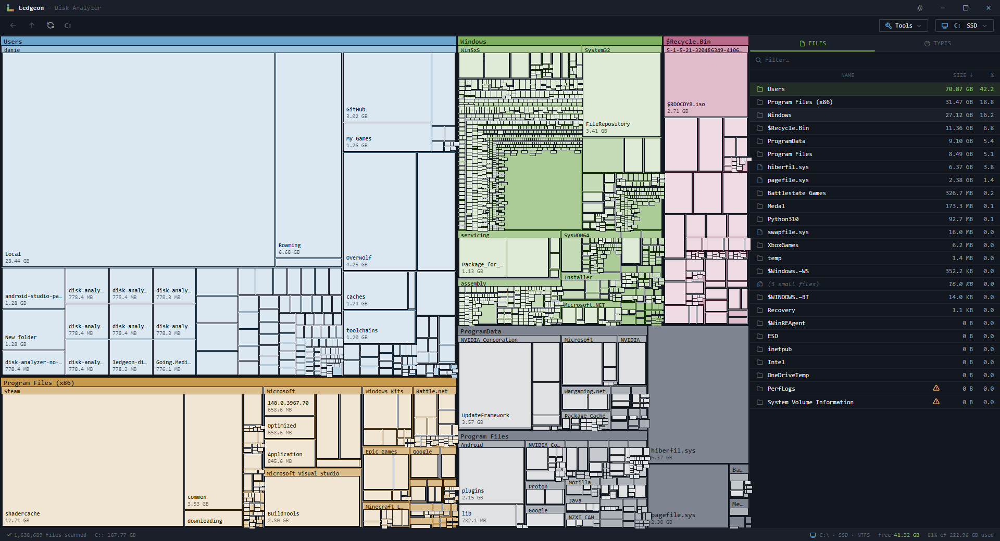

# Disk Analyzer

A disk space analyzer (Windows + Linux). Scans a drive or folder and shows what's eating the space as a treemap, with a sortable file list and a file-type breakdown alongside.

Built with Electron + React + TypeScript for the UI, and a small Rust binary for fast scanning on Windows!

## Install

Grab the latest installer from the [Releases page](https://github.com/ledgeon/Disk-Analyzer/releases). Run it, done.

- **Windows:** NSIS installer (`.exe`) — adds a "Scan with Disk Analyzer" right-click menu item for folders and drives
- **Linux (universal):** AppImage — make it executable and run it
- **Linux (Debian/Ubuntu/Mint):** `.deb` — install with `sudo apt install ./disk-analyzer_*_amd64.deb`

The rest of this README is for building from source.

## Features

- Treemap visualization with drill-in navigation
- File list with sortable columns, search, and right-click "Send to Recycle Bin"
- File type breakdown — see which extensions are eating your space
- Duplicate file finder — SHA-256 verified, safe deletion to Recycle Bin
- Drive switcher — flip between drives without re-launching
- System folders (Windows, /proc, /sys etc.) protected from accidental deletion

## What you need to build it

- [Node.js 18+](https://nodejs.org/)
- **Windows only:** [Rust toolchain](https://rustup.rs/) for the fast scanner (optional)

On Linux the Node walker is used directly. The Rust walker is currently Windows-only because it uses `FindFirstFileW`.

## Running (Windows)

```powershell
npm install
cd mft_scanner
cargo build --release
cd ..
npm run dev
```

The Rust build only needs to happen once.

## Running (Linux)

```bash
npm install
npm run dev
```

No Rust step needed.

## Building installers

**Windows:**

```powershell
npm run package
```

**Linux:**

```bash
npm run package:linux
```

Both write installers to `dist/`. The GitHub Actions workflow in `.github/workflows/build.yml` builds both platforms automatically.

## Usage

1. Pick a drive on the welcome screen
2. Click any rectangle in the treemap to drill into that folder
3. Click any folder in the right-hand list to drill in
4. Right-click a file or folder for "Open in Explorer" or "Send to Recycle Bin"
5. Use the "Drives" dropdown in the toolbar to swap to a different drive without going back to the welcome screen
6. Use "Find duplicates" to discover and clean up redundant files

## Project layout

```
src/
├── main/         Electron main process (IPC, scanner orchestration, drive detection)
├── preload/      Renderer ↔ main bridge
└── renderer/     React UI
mft_scanner/      Rust scanner (Windows-only at the moment)
build/            NSIS installer customisations
.github/          CI workflow for cross-platform builds
```

## License

PolyForm Noncommercial 1.0.0 — see `LICENSE`. Free for personal, educational, charitable, government, and other non-commercial use. Contact me for commercial licensing.
